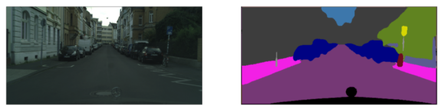
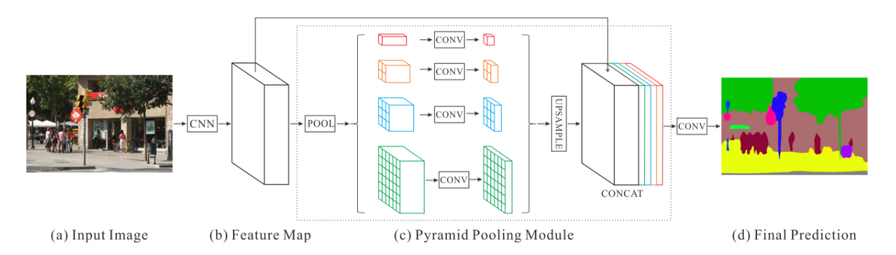
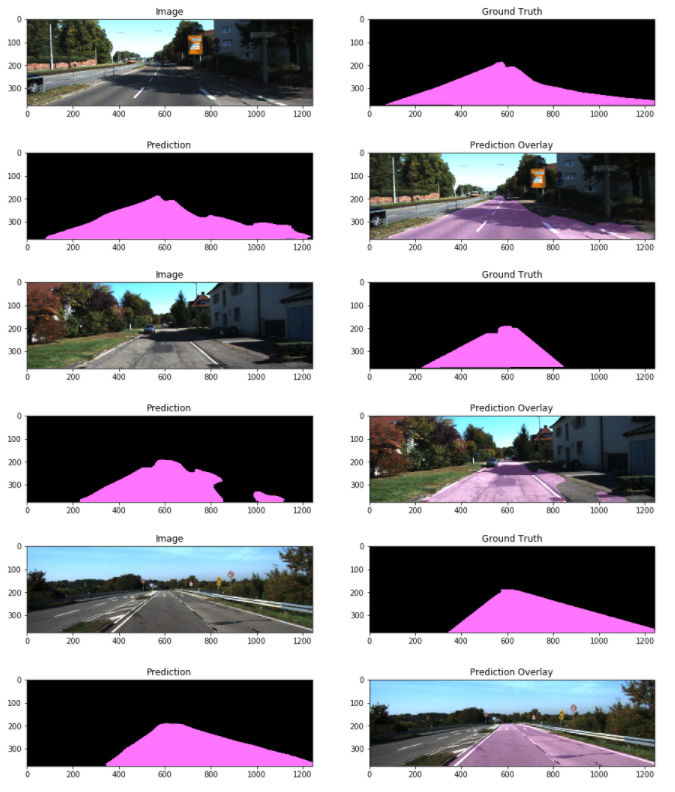
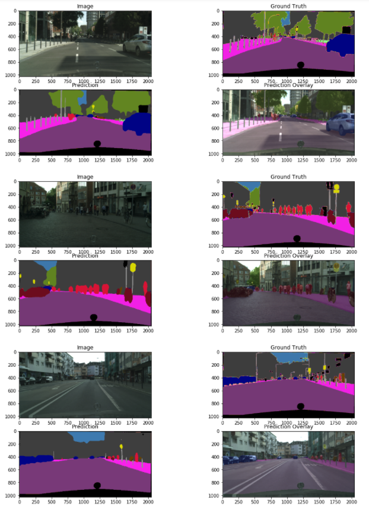

# Pyramid Scene Parsing Network for Pixel Level Semantic Segmentation
<figure>
  
</figure>
 <p></p>
 
### Overview
Rathern than VGG-16, I used VGG-19 and the weights trained on ImageNet provided by Udacity in the Deep Learning Foundations Nanodegree. My FCNN_model.py uses code provided by that nanodegree to build the network architecture, allowing me to more easily manipulate the original architecture and use useful techniques, such as atrous convolutions instead of max pooling layers.


In this repository, I will use a variation of a Fully Convolutional Neural Network with a Pyramid Pooling Module that is pre-trained on ImageNet to perform Semantic Segmentation on [KITTI Road Dataset](http://www.cvlibs.net/datasets/kitti/eval_road.php) [3] and the [Cityscapes Dataset](https://www.cityscapes-dataset.com/) [2].  

The contents of this repository include:
```
root
|   README.md
|   FCNN.ipynb
|   FCNN_model.py
|   helper.py
|   labels.py
|   inference.py
|   evaluation_KITTI.ipynb
|
|___KITI_checks
|   |   ...
|
|___cityscape_checks
|   |   ...
|
|___readme_images
|   |   ...
|
|___run
    |
    |___KITTI_results
    |   |   ...
    |
    |___citscapes_results
        |   ...
```
helper.py and labels.py provide useful functions used in FCNN.ipynb where the actual network is trained. I like to train deep nets inside a jupyter notebook so I can print out images after every epoch to visually see how the network is learning. I trained the networks incrementally over days, so you can only see results from the most recent training in my notebook. I kept results from both the cityscapes training and the KITTI training so a viewer who does not have access to a GPU can see for themselves. inference.py freezes the model graph for quicker inference and saves the image results of the trained network for both KITTI and Cityscapes test datasets, and I have included my results in the run folder of this repository. evaluation_KITTI.ipynb can be used to calculate per-pixel per-class accuracy using the frozen graph on the KITTI Dataset. This is already done for some classes inside FCNN.ipynb for the Cityscapes Dataset.

Depencies for running FCNN.ipynb:
 - Python 3
 - TensorFlow
 - NumPy
 - SciPy
 - OpenCV
 - Matplotlib

### Methods
<figure>
  
</figure>
 <p></p>
Image citation: https://hszhao.github.io/projects/pspnet/

After preliminiary experiments using a pre-trained VGG 19 layer network as an encoder, replacing the fully-connected layers with 1x1 convultions, and using transposed convolutions with skip connections from the encoder's pooling layers to upsample as a decoder, as described in [4], I decided to keep experimenting and try to replicate the results of a state-of-the-art network. My best results came from a newtork very similar to PSPnet as described in [5]. Above is broad overview diagram of the network acrhitecture. Below is the exact architecture I used. In the last layers of my encoder, instead of max-pooling, I use dilated or atrous convolutions [1], which preserves the number of parameters while increasing the field of view without having to downsample. Therefore, the pre-trained VGG 19 weights can be used in the decoder without losing important spatial information, which may be irrelevant for classification tasks but is very helpful for pixel level segmentation. Transposed convolutions are used after the pyramid pooling module to upsample pixel level predictions to the original input size.  

Encoder:
| Layer     | Description | 
|:--------------:|:-------------:| 
| Input            | images in the shape [batch size, None, None, 3] | 
| Conv1_1          | filter=3x3, stride=1, num_layers=64, activation=ReLU| 
| Conv1_2          | filter=3x3, stride=1, num_layers=64, activation=ReLU|  
| Max Pool_1       | filter=2x2, stride=2| 
| Conv2_1          | filter=3x3, stride=1, num_layers=128, activation=ReLU| 
| Conv2_2          | filter=3x3, stride=1, num_layers=128, activation=ReLU|  
| Max Pool_2       | filter=2x2, stride=2| 
| Conv3_1          | filter=3x3, stride=1, num_layers=256, activation=ReLU| 
| Conv3_2          | filter=3x3, stride=1, num_layers=256, activation=ReLU|  
| Conv3_3          | filter=3x3, stride=1, num_layers=256, activation=ReLU| 
| Conv3_4          | filter=3x3, stride=1, num_layers=256, activation=ReLU|
| Max Pool_3       | filter=2x2, stride=2| 
| Conv4_1          | filter=3x3, stride=1, num_layers=512, activation=ReLU| 
| Conv4_2          | filter=3x3, stride=1, num_layers=512, activation=ReLU|  
| Conv4_3          | filter=3x3, stride=1, num_layers=512, activation=ReLU| 
| Atrous Conv4_4   | filter=3x3, stride=1, num_layers=512, activation=ReLU|
| Conv5_1          | filter=3x3, stride=1, num_layers=512, activation=ReLU| 
| Conv5_2          | filter=3x3, stride=1, num_layers=512, activation=ReLU|  
| Conv5_3          | filter=3x3, stride=1, num_layers=512, activation=ReLU| 
| Atrous Conv5_4   | filter=3x3, stride=1, num_layers=512, atrous_rate=4, activation=ReLU|
|     |     |

Decoder PSP:
| Layer     | Description | 
|:--------------:|:-------------:| 
| PSP5_1        | max-pooling so output size is 1x1x512| 
| PSP5_2        | max-pooling so output size is 2x2x512|
| PSP5_3        | max-pooling so output size is 3x3x512| 
| PSP5_4        | max-pooling so output size is 6x6x512|
| 1x1Conv6_1    | input=PSP5_1, num_layers=64, activation=Leaky ReLU, batch_norm=False| 
| 1x1Conv6_2    | input=PSP5_2, num_layers=64, activation=Leaky ReLU, batch_norm=True|
| 1x1Conv6_3    | input=PSP5_3, num_layers=64, activation=Leaky ReLU, batch_norm=False|
| 1x1Conv6_4    | input=PSP5_4, num_layers=64, activation=Leaky ReLU, batch_norm=True|
| Upsample7_1   | input=1x1Conv6_1, method=bilinear, out_shape=1/8 input image size| 
| Upsample7_2   | input=1x1Conv6_2, method=bilinear, out_shape=1/8 input image size| 
| Upsample7_3   | input=1x1Conv6_3, method=bilinear, out_shape=1/8 input image size| 
| Upsample7_4   | input=1x1Conv6_4, method=bilinear, out_shape=1/8 input image size| 
| 1x1Conv8      | input=Atrous Conv5_4, num_layers=256, activation=Leaky ReLU, batch_norm=True|
| Fuse8         | input=[Upsample7_1, Upsample7_2, Upsample7_3, Upsample7_3, 1x1Conv8], method=concatenate along channel axis|
| 1x1Conv9      | input=Fuse8, num_layers=512, activation=Leaky ReLU, batch_norm=True| 
|     |     |

Decoder Usample:
| Layer     | Description | 
|:--------------:|:-------------:| 
| TransConv10   | filter=3x3, stride=2, num_layers=128, activation=Leaky ReLU, batch_norm=True|
| TransConv11   | filter=3x3, stride=2, num_layers=128, activation=Leaky ReLU, batch_norm=True|
| TransConv12   | filter=3x3, stride=2, num_layers=64, activation=Leaky ReLU, batch_norm=True| 
| Conv13        | filter=3x3, stride=1, num_layers=64, activation=Leaky ReLU, batch_norm=False| 
| Conv Logits   | filter=3x3, stride=1, num_layers=num_classes, activation=None|
| Out | softmax |
|     |     |

To help combat overfitting, some data augmentation was used. Before being processed by the network, images are randomly cropped to maintain the original image's aspect ratio, and radomly flipped horizontally. Since this network is fully convolutional, it can accept images of any size. Image inputs are all reduced in size to reduce computation time, but for both datasets aspect ratios were always maintained.

### Results
KITTI validation set: 
Mean IOU: 0.9533

Because I split the KITTI dataset randomly into validation and training sets during training, I could not recover the exact validation set I used. But on all the training data, I received the following results (see evaluation_KITTI.ipynb for the calculation):
% of road pixels accurately labeled: 0.9826
% of background pixels accurately labeled: 0.9882


Cityscapes validation set:
Mean IOU: 0.4955

Pixel accuracy by some of the classes:
% of road pixels accurately labeled: 0.9529
% of cars pixels accurately labeled: 0.8735
% of traffic signs pixels accurately labeled: 0.2829
% of persons pixels accurately labeled: 0.4025

The network is very good with the road and with cars, but with smaller, more difficult objects, like persons and traffic signs, it is less successful.

NOTE: I trained on the cityscapes incrementally over several days. It seems that the model is still learning, but my AWS costs are accumulating and the results are pretty good, so I stopped training for now.

Since neither KITTI or Cityscape Datasets provide public ground-truth labels for the test sets, you can find my results saved as .png files in the run/KITTI_results and run/cityscapes_results directories. To recreate my results for the KITTI test set use
...
python run/inference.py KITTI data_dir check_dir
...
where data_dir is where the test images are stored and check_dir is where the model and checkpoints are stored. First the model will be frozen to increase inference speed. Two images will be saved for each input, a prediction and that prediction overlayed the original input. Replace "KITTI" with "cityscapes" to recreate my cityscape results.

KITTI examples:
 <figure>
  
</figure>
 <p></p>
 
Cityscapes examples:
 <figure>
  
</figure>
 <p></p>

### References
[1] L. Chen, G. Papandreou, I. Kokkinos, K. Murphy, and A. L. Yuille. "Deeplab: Semantic image segmentation with deep convolutional nets, atrous convolution, and fully connected crfs." arXiv:1606.00915, 2016.
[2] M. Cordts, M. Omran, S. Ramos, T. Rehfeld, M. Enzweiler, R. Benenson, U. Franke, S. Roth, and B. Schiele. "The Cityscapes Dataset for Semantic Urban Scene Understanding," in Proc. of the IEEE Conference on Computer Vision and Pattern Recognition (CVPR), 2016.
[3] J. Fritsch, T. Kuehnl, and A. Geiger. "A New Performance Measure and Evaluation Benchmark for Road Detection Algorithms," in Proc. of the International Conference on Intelligent Transportation Systems (ITSC), 2013.
[4] J. Long, E. Shelhamer, and T. Darrell. Fully convolutional networks for semantic segmentation. In CVPR, 2015.
[5] H. Zhao, J. Shi, X. Qi, X. Wang, and J. Jia. "Pyramid Scene Parsing Network." arXiv:1612.01105, 2017.

